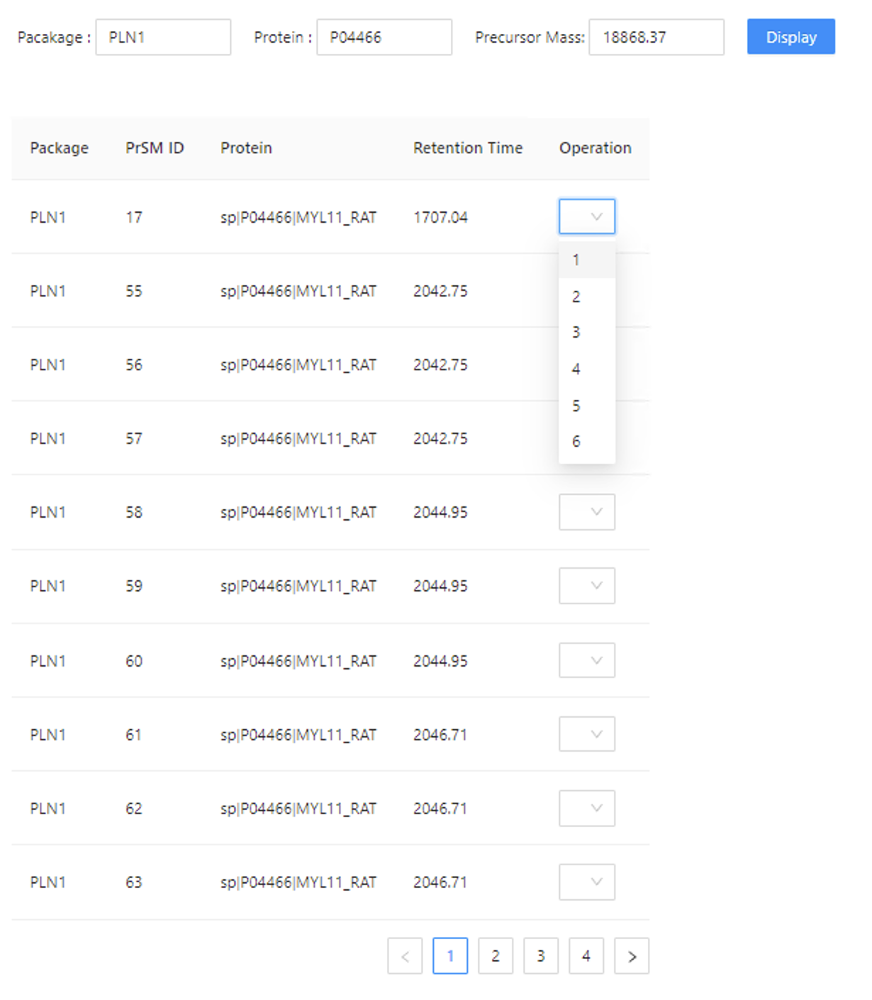
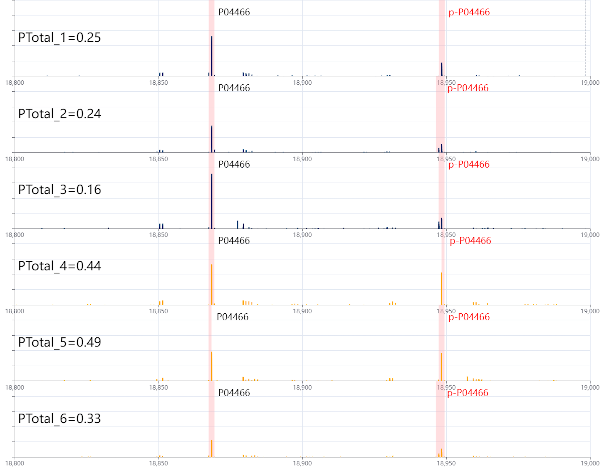
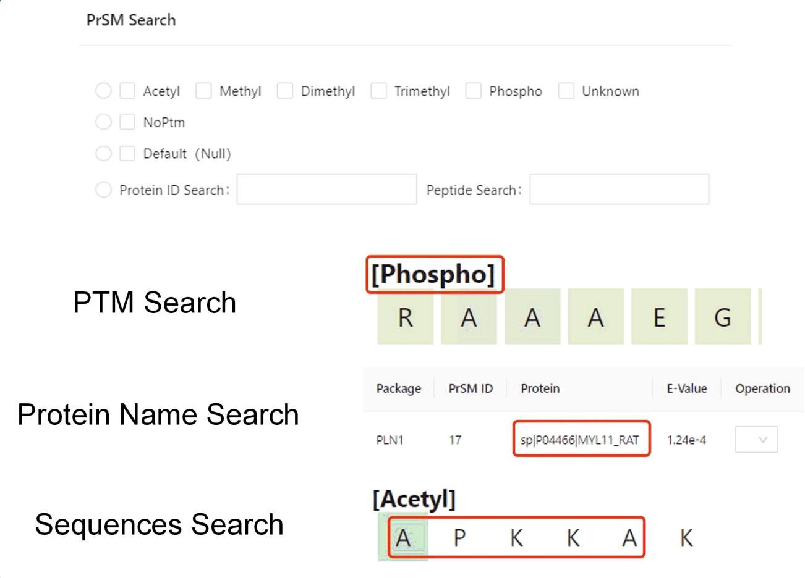
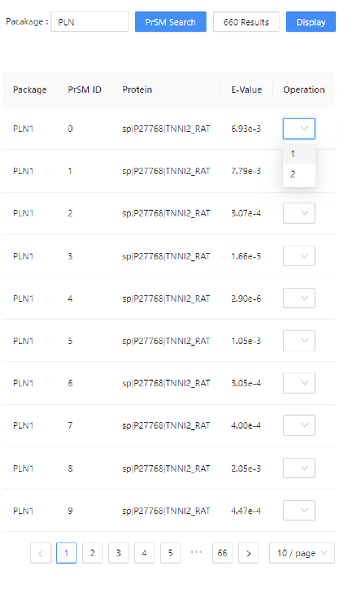
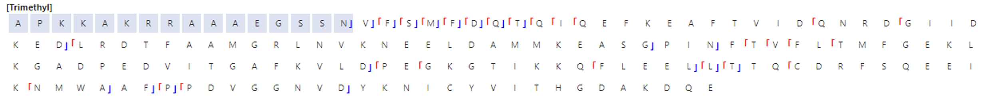
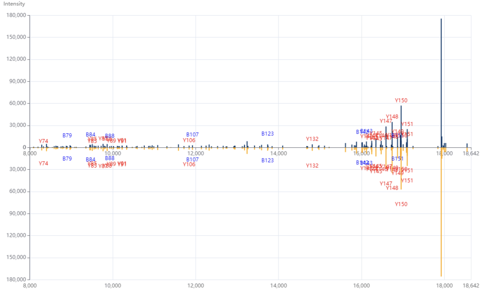

# TDMSVA
Proteins are dominant executors of living processes. Top-down mass spectrometry is used to identify and characterize intact proteoform. When compared to bottom-up MS, top-down MS is more effective for identifying and localizing post-translational modifications. Single-cell top-down proteomics method reveal how single-cell protein heterogeneity contributes to cellular functions. The diverse data generated during mass spectrometry identification necessitates the use of specialized visualization tools enhance management and analysis efficiency in single-cell top-down proteomics.
We introduce TDMSVA, a comprehensive tool for visualizing and analyzing quantitative phosphorylation data from single-cell top-down MS. Developed using C++ and Vue3.js, TDMSVA enables the integration, analysis, and visualization of multi-group single-cell top-down MS data within a unified web interface. Upon importing MS files, users can explore raw MS data, deconvoluted spectra, and proteoform- spectrum matches through flexible search functionalities. TDMSVA provides multiple visualization modes, enabling detailed quantitative phosphorylation analysis and comparative studies across different datasets. This platform streamlines the end-to-end process of single-cell top-down MS data management, offering an intuitive solution for data visualization and analysis.

Here we present a demo for using TDMSVA.

### Quantitative analysis of phosphorylation

Input packages (Support fuzzy search), protein (Uniprot ID, Support fuzzy search), and precursor protein mass:

Showing scatter plots and box plots of Ptotal：

  

***

### Deconvolution MS quantitative phosphorylation analysis

Input packages (Support fuzzy search), protein (Uniprot ID, Support fuzzy search), and precursor protein mass. The program displays the deconvoluted MS which can be optionally displayed. Then select the area you want to display.

  

***

### PrSM Advanced Search
The tool supports three PrSM search methods: PTM Search, Protein Name Search and Sequences Search.

  

***

### PrSM Visualization
Select the PrSM you searched for and choose the region to display.

Click on the fragment ion symbol in the proteoform sequence, and the histogram will automatically zoom to the corresponding match MS peak.

