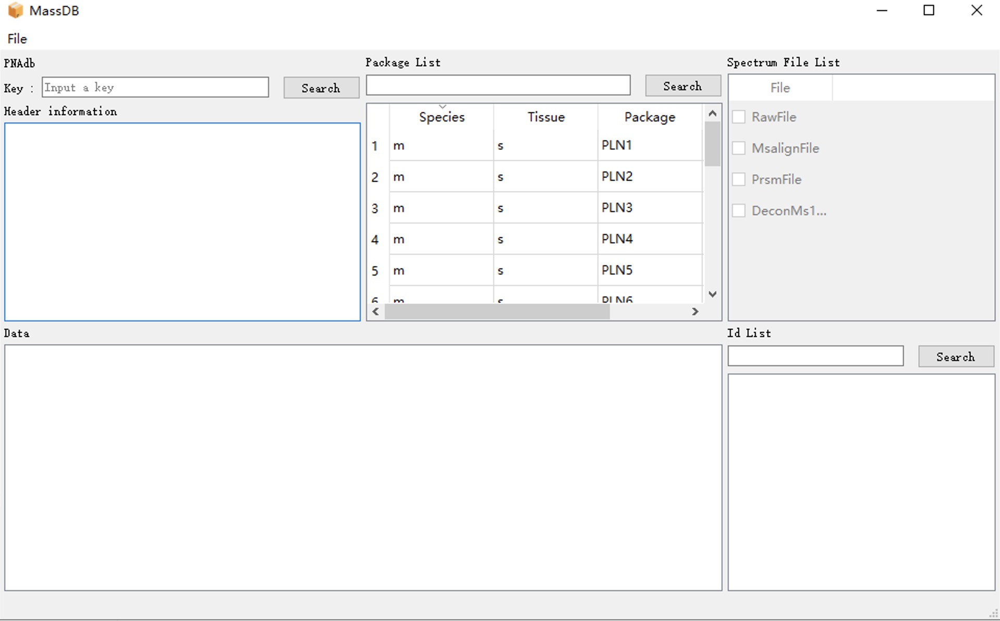
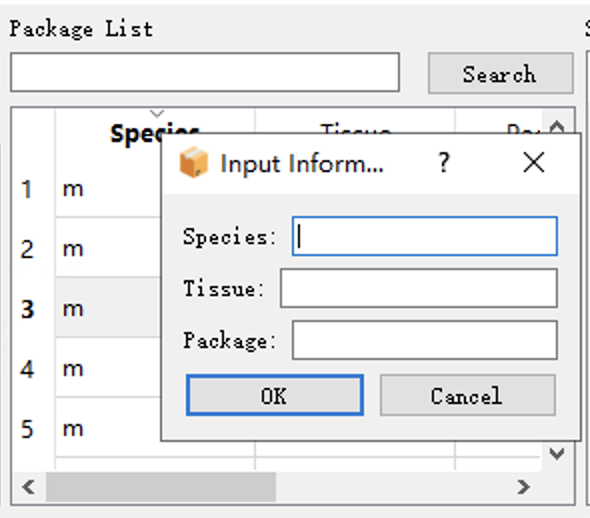
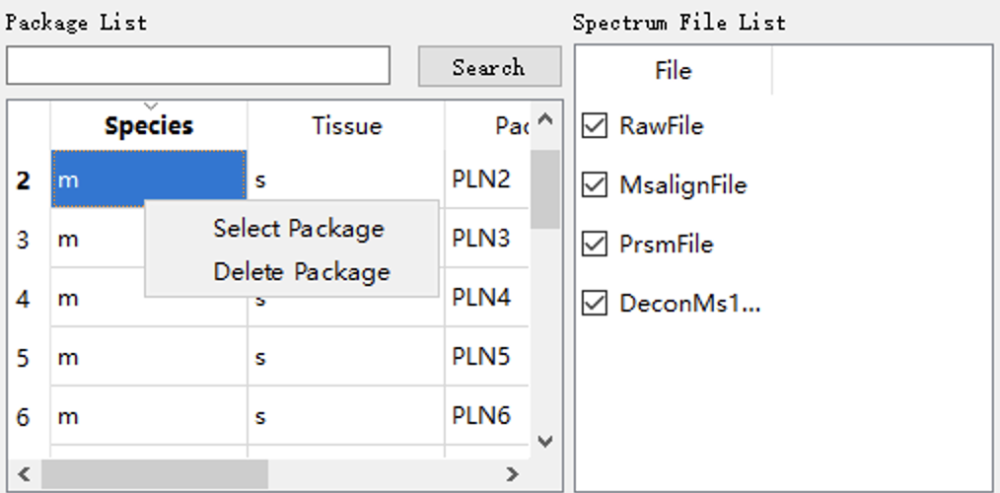

# Configuration

## TDMSVA backend configuration

 Use MSYS2 to install the system environment required by the program backend on Windows.

```shell
pacman -S git # Optional
pacman -S mingw-w64-x86_64-gcc
pacman -S mingw-w64-x86_64-make
pacman -S mingw-w64-x86_64-cmake
pacman -S mingw-w64-x86_64-boost
pacman -S mingw-w64-x86_64-qt5	# select 3，mingw-w64-x86_64-qt5-base 
pacman -S mingw-w64-x86_64-xerces-c
pacman -S mingw-w64-x86_64-eigen3
pacman -S mingw-w64-x86_64-nlohmann-json
pacman -S mingw-w64-x86_64-asio
```

After MSYS2 installation，Add `mingw64\bin` to the user's **PATH** environment variable.

To ensure that the programming is installed successfully, you can check the source of the g++ command. The source of the g++ command must be in the MSYS2 path.

```shell
Get-Command -Name g++
```

Change the CMAKE_PREFIX_PATH property value of the CMakeLists.txt file in the project directory to your own mingw64 path.
```txt
set(CMAKE_PREFIX_PATH "xxx/mingw64")
```

Open the backend project file directory and create a **build** subdirectory in the directory to store compiled files.

```shell
mkdir build 
cd build 
```

Then use CMake to generate the build files.

```shell
# Build the CMakeLists.txt file in the previous directory and generate the makefile file
cmake -G "MinGW Makefiles" .. 
```

Generate **all executable files** in the project according to the makefile file

```shell
mingw32-make
```

Or you can use `mingw32-make executable program name` to **generate** a specific running program separately

```shell
mingw32-make massdb_gui # Generate backend GUI
mingw32-make network_server # Generate a network server
```

After executing the `mingw32-make` command, an executable program will be generated in the **build** folder.


## MSYS2 Usage

View all installed libraries

```shell
pacman -Q
```

Completely remove the library and its dependencies (using only the -R command may result in incomplete removal)

```shell
pacman -Rdd Library Name
```


# Usage

## TDMSVA backend GUI


<br><br><br>

1.Select an empty folder to create a databas.<br><br>
<br>


2.Click **Build** or **right-click** in the package lists area to create a Package.<br><br>
<br>

3.Enter the package information. The package name cannot be repeated in the database.<br><br>
<br>

4.Right-click the created package and select Package. Next, you can import the mass spectrometry file<br><br>

## File Format
RawFile: .mzML or .maXML   （Importing need takes a longer time）<br>
MsalignFile: ms2.msalign<br>
PrsmFile: .tsv or .csv  (Currently supports TopPIC PrSM results)<br>
DeconMs1: ms1.msalign<br>


## Network Services
1.Close the GUI after the data import is complete.<br>

2.To facilitate local debugging,the network service has a fixed path to connect to the database in the source code.<br>
```shell
db.Init(R"(DATABASE_PATH)", false);

// db.Init(R"(E:\PNAdb)", false);
```
3.Run network_server.exe